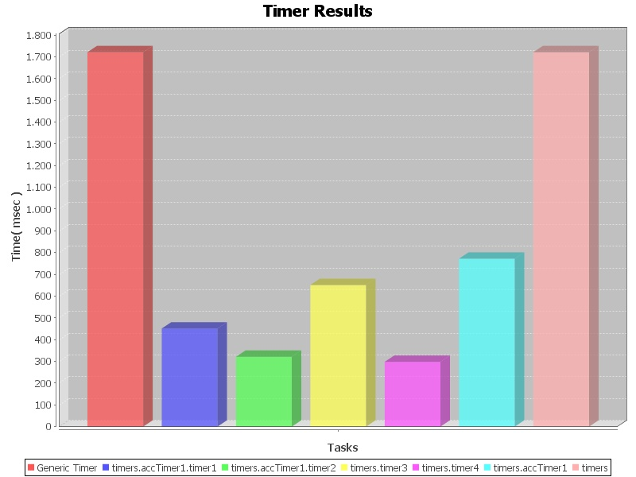

# Timer

Timer is a lightweight JAVA API, for measuring the time that is needed for doing various things. 
The timer API is intended to be used for JAVA developers and testers that want to record the 
time measurements of their source code, without bothering with particular hacks in their code to do it.

If you want to measure the time that is needed for a method to complete, or only a particular portion of code,
or if you want to measure how much of the execution time was concumed in executing a particular method again and again 
then timer is for you.

The philosofy of the timer API is based on value assignments, in order to quickly and reliably capture the time of particular tasks.

## The timers

All the timers have an identity. This allows exploiting many different timers in our source code. Apart from them there are also 
the default (or un-named) timers; they can be particularly useful if no other timers exists.
For identifying timers we use a naming scheme similar to JAVA naming packaging convention. For example the following identities 
are valid identifiers:
```
timer1
timer.querying
timer.querying.query1
```
The above schema allow us to group timers into common groups. For example suppose that we want to measure the time efficiency 
of a component that is responsible for querying 3 different sources (A, B, and C respectively). For this reason we want to 
measure the time needed for the 3 different query executions and group them together as follows:
```
querying.queryA
querying.queryB
querying.queryC
```

## Timer operations 

Timers can have 3 different operations/statuses:

* **start** : this operation starts the timer 
* **stop** : this operation stop the timer (you can start it again afterwards)
* **restart** : this operation resets the timer and start it again (removes the previous time intervals)

The difference between start and restart, is that after restarting a timer it becomes empty and it can be reused (practically we reset the timer), while if we stop it and the start it, practically we resume it.

### Reporting

Apart from measuring, timers also report the recorded time. The reporting can be done using different time units 
(i.e. milliseconds, seconds, minutes, hours). Apart from this the time can be measured in a human friendly format 
(i.e. 2 hours, 23 minutes, 4 seconds, 22 milliseconds.)
Finaly timer reporting also support accumulating the time from different timers in the same group. Suppose for example that 
apart from measuring the time that is needed for the 3 queries (in the example above) we want to report the overal time 
for the querying (of all the 3 sources.) For this reason we can just ask for the time of the timer with id "quering" 
(the naming convention for timer identifiers is particularly useful here). Practically:
```
Timer.report("querying", TimeUNIT.SECONDS)
==
Timer.report("querying.queryA", TimeUNIT.SECONDS) + 
Timer.report("querying.queryB", TimeUNIT.SECONDS) + 
Timer.report("querying.queryC", TimeUNIT.SECONDS) 
```

Timer API supports also the generation of plots with the time measurements. The user can either generate a plot 
containing all the used timers, or create custom plots with specific timers. An indicative figure showing the plot 
that is exctracted is shown below.



## Download

Timer is API has been developed as a maven project. Therefore it can be downloaded using the following maven coordinates
```
<groupId>gr.forth.ics.isl</groupId>
<artifactId>timer</artifactId>
<version>2.0</version>
```

The above artifacts can be found in the FORTH-ICS ISL maven repository that can be found at:
```
http://www.ics.forth.gr/isl/maven
```

For more information about the different version of the Timer API, take a look at the [change log](https://github.com/ymark/Timer/blob/master/change-log.md). 

## Contacts

If you face any issues or you want to suggest new features please open an issue, or contact me

* Yannis Marketakis &lt;marketak 'at' ics 'dot' forth 'dot' gr&gt;
